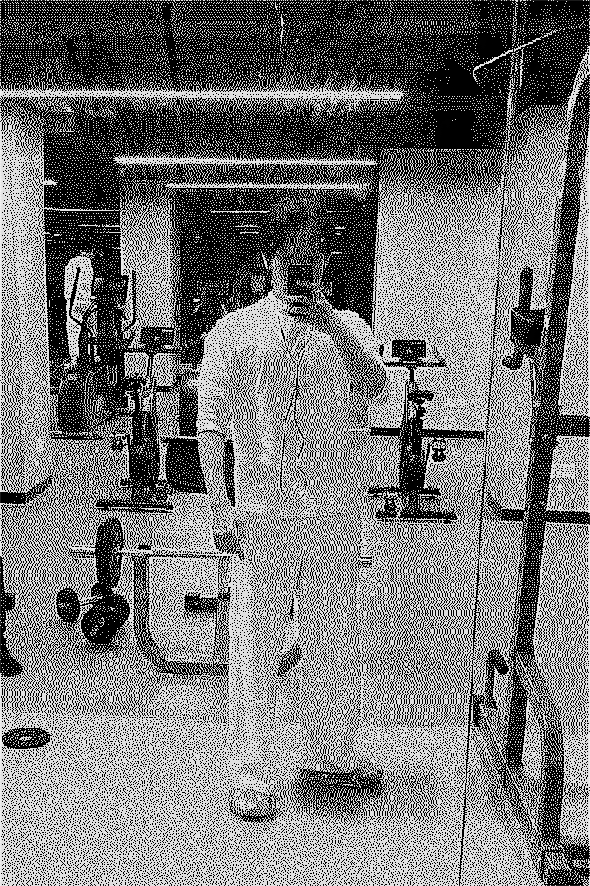

### MAR 18, 2026
我认为衡量好老师的标准，在于他能否通过人格魅力，让学生化被动为主动。何其有幸，在我的成长过程中遇到过几位这样的老师。

### MAR 17, 2026
读了一半的《斯通纳》，太压抑了，读不下去。先封本吧，有新的想法的时候再拿出来读。

### MAR 11, 2026
今天开始读《斯通纳》。

### MAR 10, 2026
这个学期第一次去健身房。

### MAR 09, 2026
为档案馆挂上了正式的门牌号：aboarchive.site。做了一些细小的改动，网站易读性更好了。

### MAR 08, 2026
增加了Daily Log边栏。

### MAR 07, 2026
在宿舍里学了一天Excel，傍晚和舍友出去吃了顿饭。

### MAR 06, 2026
实验课结束，今天只讲了一些基本操作。
